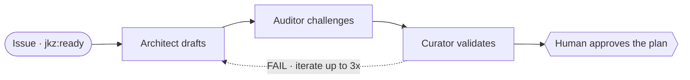

Planning is the high-leverage phase: a shallow plan forces rework everywhere downstream, so jkz spends three roles on it before a line of code exists. The phase is the pipeline's pattern in miniature — **Opus creates → an adversarial backend challenges → a validator backend confirms** — and it runs entirely on plan comments. Nothing here touches code; the deliverable is a plan you approve at the [human checkpoint](/get-started/how-jkz-works/#where-the-human-comes-in).

| Role | Class | Model / backend | Mission |
|------|-------|-----------------|---------|
| **Architect** | creative | Claude Opus (Task tool) | Designs the implementation strategy — why before how, scope before code. |
| **Auditor** | adversarial | External backend (required) | Challenges the plan: what is missing, vague, or will fail. |
| **Curator** | validator | Ollama Cloud / Gemini | Validates the audit — calibrates severity, catches false positives and missed gaps. |

The roles never message each other. The Architect's plan, the Auditor's review, and the Curator's verdict are each a Git artifact, and the next role reads the previous one's artifact — not its reasoning.

## Architect — the designer

The Architect understands the full picture before it says a word: the *why* before the *how*, the foundation before the structure. Its plans are structures, not checklists — every step is load-bearing, specific enough that a Builder can execute it without coming back to ask a question (the "chair test"). It commits to one approach rather than hedging between alternatives.

**Model / backend.** Claude Opus, the `creative` class. Invoked directly through the Task tool (`model: "opus"`), not a wrapper — the Orchestrator embeds the role definition and dispatches it in-session.

| Inputs | Outputs |
|--------|---------|
| Issue description; any research pre-docs; codebase context; the previous iteration's Auditor + Curator feedback (rounds 2–3) | A structured Markdown plan — Spec Adoption Map, Objective, Scope, numbered implementation steps with file paths, data-flow paths, files affected, dependencies, a premortem risk table, acceptance criteria, and a testing strategy — plus a compact-plan signal downstream agents reuse |

**In the flow.** First. The Architect drafts; everything else in the phase reacts to its plan.

## Auditor — the challenger

The Auditor reviews a plan the way a CEO evaluates a proposal: it does not care about the effort that went in, only whether the plan will deliver. It hunts for what is missing, what is vague, and what will fail before a single line is written. It is adversarial, not obstructive — the default verdict is **PASS**, and a finding only counts if it is a concrete, evidence-backed problem. Style preferences are noise; a `CRITICAL` needs execution or a file citation behind it, not reasoning alone. The review is capped at ten issues so it stays focused on what matters.

**Model / backend.** The `adversarial` class, served by an external OpenAI-compatible backend resolved at runtime from `JKZ_AUDITOR_ENDPOINT` / `JKZ_AUDITOR_MODEL`. The endpoint is **required** — there is no silent fallback to a local CLI; without it the wrapper stops the phase rather than skip the challenge. Invoked via `node scripts/run.js resolve-wrapper.sh --role auditor`.

| Inputs | Outputs |
|--------|---------|
| The Architect's plan; codebase context for verification; the original issue description | A Markdown review — TL;DR, the issues found (severity, category, location, evidence, suggested fix), and a **PASS / FAIL** verdict — posted as a PR comment, with a machine-readable `verdict-json` block |

**In the flow.** Second. It evaluates claims by the [evidence hierarchy](/reference/architecture/) — execution beats file citations, which beat reasoning — and a `FAIL` sends the plan back to the Architect.

## Curator — the validator

The Curator validates the audit, not just the plan. Its eye is calibrated for the anomaly *in the review*: a false positive that would waste an iteration, a miscalibrated severity, a gap the Auditor missed. A small flaw in the audit tells it everything about the rigor behind it. Crucially, the Curator is the **tiebreaker** — when the Architect and Auditor disagree, it must deliver a reasoned verdict from codebase evidence, never punt the decision back.

**Model / backend.** The `validator` class. By default it routes to Ollama Cloud (`glm-5.1:cloud`) through the same configurable endpoint mechanism (`JKZ_CURATOR_ENDPOINT`); when no endpoint is set, validator roles fall back to a local Gemini CLI. Invoked via `node scripts/run.js resolve-wrapper.sh --role curator`.

| Inputs | Outputs |
|--------|---------|
| The Architect's plan; the Auditor's review; codebase context; the original issue description | A validation report — TL;DR, an audit-quality assessment (coverage, accuracy, severity calibration, constructiveness), corrections to the Auditor's findings, any issues the Auditor missed, and a **PASS / FAIL** verdict — with a `verdict-json` block |

**In the flow.** Third and last. Its verdict closes the round.

## How the three fit together

A `FAIL` from either reviewer returns the plan to the Architect for another round, up to three. The Auditor and Curator do not re-litigate issues the Architect already resolved on iteration 2+; they check that the fixes held and that nothing new broke. Exhaust three rounds without a clean plan and the phase stops and escalates to you — jkz does not ship a plan that merely survived the loop.

When the Curator passes, planning is done, but the pipeline still cannot proceed on its own:

:::note[Nothing is built until you approve]
After the Curator's PASS, an Opus ambiguity gate classifies any remaining ambiguity as `TRIVIAL`, `FIX`, or `DECIDE` — a `DECIDE` needs your call. Then you read the plan and approve it. Only then does the [Build phase](/build/coming-soon/) begin.
:::

For the whole pipeline and the other roles, see [How jkz works](/get-started/how-jkz-works/); for backend routing and fallback tiers, see [Architecture](/reference/architecture/); for the commands that drive each phase, see [CLI / commands](/reference/cli/).
