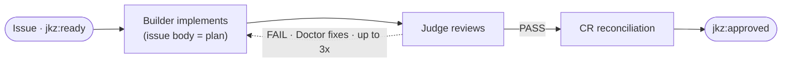

Not every change needs the full plan → build → review → QA loop. A typo, a one-line bug fix, a config tweak — running an Architect, an Auditor, and a QA pass on those wastes tokens and your time. jkz has two lightweight routes for exactly this: **`/jkz:quick`** for small scoped changes, and **`/jkz:fix`** for the surgical repair cycle. This page covers what each does, when to reach for it, and how the complexity classifier decides whether you land here or in the full pipeline.

## How you get routed here

When you start from a raw idea or an existing issue, the **Classifier** (Claude Haiku) sizes the work into one of three complexity buckets. The bucket determines the route:

| Complexity | What it means | Route |
|------------|---------------|-------|
| `trivial` | The approach is obvious. Opus can resolve it directly in a chat session — no formal plan or review cycle. May touch multiple files. (Rename a variable, add an env var, fix a clear bug, update docs.) | Direct in chat — no pipeline |
| `quick` | A scoped change that benefits from lightweight structure but not a full pipeline. The direction is clear but involves some decisions. (Add a CLI flag with validation, a small feature with tests, a bug that needs investigation.) | [`/jkz:quick`](#jkzquick--builder--judge) |
| `standard` | Multi-faceted work: design decisions, multiple system layers, non-obvious implications. (Refactor a subsystem, add an agent role, a feature spanning components.) | Full `/jkz:pipeline` |

Classification is hybrid: an LLM call (Haiku) is primary, with a deterministic scoring fallback if the model is unavailable. The fallback adds points for design keywords, layer count, and file count, and subtracts for self-contained one-file changes — `score >= 4` is `standard`, `score <= -2` is `trivial`, everything between is `quick`. A `chore` label biases toward `quick`; a compliance keyword bumps a `trivial` result up to `quick` so it never skips review entirely.

The classifier *recommends* — you decide. `/jkz:quick` re-classifies on the spot if the issue has no `complexity:*` label, and if it comes back `standard` it warns you and offers the full pipeline before doing anything.

:::note[Source of truth]
The complexity definitions and scoring live in the private repo at `scripts/classify-issue.js`. The route behavior is defined in `.claude/commands/jkz/quick.md` and `fix.md`. This page summarizes them for public reference.
:::

## `/jkz:quick` — Builder + Judge

`/jkz:quick <issue-number>` is the minimum viable pipeline: **two agents, one reviewer, no plan, no QA.**

The flow is deliberately stripped down compared to the [full pipeline](/get-started/how-jkz-works/):

- **No Architect.** There is no formal plan — *the issue description is the plan*. The Builder reads the issue and implements it directly inside an isolated worktree, then opens the PR.
- **The Judge is the sole reviewer.** It reviews the diff against the issue body. There is **no CodeRabbit pre-scan** (not worth the latency for a trivial change) and **no Inspector** (the Judge calibrates to the small scope).
- **No QA phase.** Lens and Sentinel do not run.
- **CR reconciliation, only after a PASS.** Once the Judge passes, CodeRabbit-bot findings are triaged lightweight — the orchestrator classifies each as VALID / FALSE_POSITIVE / OUT_OF_SCOPE / ALREADY_FIXED and fixes the VALID ones directly (no Doctor subagent). If a fix is pushed, the Judge re-reviews once.
- **On FAIL, the Doctor fixes — up to 3 times.** Same fix cycle as the full pipeline (see below). Three failed attempts move the issue to `jkz:blocked` and escalate to you.

Everything else holds: the change runs in a per-issue worktree, the PR closes the issue via a `Closes`/`Fixes` keyword, and **only a human merges** — the lightweight route does not weaken the merge gate.

### When to use `/jkz:quick`

| Use it for | Do **not** use it for |
|------------|-----------------------|
| Fixes of roughly 1–10 lines | New features |
| Documentation-only changes | Architectural changes |
| Config changes with obvious scope | Security-sensitive code |
| Typo fixes, minor refactors | Anything touching more than ~5 files |

If a change has any of the right-hand qualities, reach for the full `/jkz:pipeline` instead — the planning and QA phases exist precisely for work with design decisions or wide blast radius.

## `/jkz:fix` — the Doctor's fix cycle

`/jkz:fix <pr-number> --source <review|qa>` is not a route you usually invoke by hand. It is the **fix cycle** that `/jkz:review` and `/jkz:qa` (and `/jkz:quick`) call automatically whenever a reviewer returns FAIL. Its job: take the failing verdict, apply a minimal targeted fix, and re-trigger the phase that failed.

The agent behind it is the **Doctor** (Claude Opus). It changes exactly what broke and nothing more: no scope creep, no opportunistic refactors.

What happens inside one fix cycle:

1. **Gather feedback.** Collect the CRITICAL/HIGH findings from the failing verdict (compact `verdict-json` signals on later iterations, full PR comments on the first).
2. **Flaky check.** A classifier spots flaky test failures and re-runs the phase *without* counting it as a fix attempt — a flaky test should not burn the Doctor's budget.
3. **Classify the failure** into one of eight categories (implementation bug, missing validation, missing error handling, security vulnerability, missing requirement, test gap, wrong approach, regression). If the category is `wrong_approach`, a one-time gate lets the **Architect** rewrite the plan before the Doctor tries again (max one rewrite per pipeline).
4. **Loop guard.** From iteration 2 on, jkz compares the new diff against the previous attempt. A near-identical diff triggers a warning so the Doctor changes strategy instead of repeating a dead end.
5. **Fix and re-trigger.** The Doctor applies the patch and the diff goes back through the failed phase — review (Judge + Inspector) or QA (Lens + Sentinel).

This repeats **up to three attempts**. If three fixes still don't clear the verdict, the issue moves to `jkz:blocked` and escalates to you with a diagnosis of what was tried — **honest escalation over a silent hack** that merely passes the checks.

### When `/jkz:fix` fires

- Automatically, whenever Judge, Inspector, Lens, or Sentinel returns FAIL during a review or QA phase.
- Manually, when you want to re-run the Doctor against a known-failing PR: `/jkz:fix <pr-number> --source review` (or `--source qa`).

## Choosing a route at a glance

| You have… | Reach for… |
|-----------|-----------|
| A typo, a one-line fix, a doc edit | Edit directly, or `/jkz:quick` |
| A small scoped change with a clear direction | `/jkz:quick` |
| A feature, a refactor, anything with design decisions | The full pipeline — start at [How jkz works](/get-started/how-jkz-works/) |
| A PR that a reviewer just failed | `/jkz:fix` (usually automatic) |

The full plan → build → review → QA pipeline and every command's model line-up are covered in [How jkz works](/get-started/how-jkz-works/) and the [CLI / commands reference](/reference/cli/).
