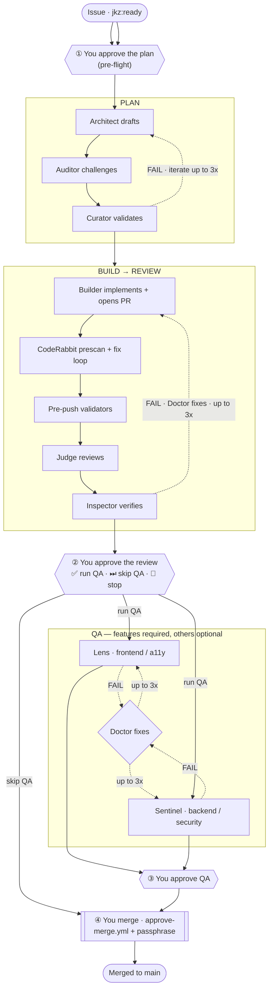

[`/jkz:pipeline <issue-number>`](/commands/pipeline/) drives one issue from `jkz:ready` to a merge-ready PR through four phases — **Plan → Build → Review → QA** — and stops at every point that needs a human. This page is the operator's view: the command you run, what happens between checkpoints, and exactly what you decide at each one. For the conceptual model (the twelve roles, the multi-backend deliberation loop, why merge stays human) read [How jkz works](/get-started/how-jkz-works/) first; this page assumes it.

## The one command

```bash
/jkz:pipeline 1234
```

That is the whole invocation for a fresh run. Three flags adjust it:

| Flag | Effect |
|------|--------|
| `--resume` | Continue an interrupted run from its last `current_phase` (see [Recovering a run](#recovering-a-run)). |
| `--from <phase>` | Force the start phase (`plan`, `build`, `review`, `qa`). |
| `--silent` | Suppress Telegram checkpoint notifications; approvals still happen in the chat. |

The pipeline runs the phases autonomously *between* checkpoints. It never reaches `main` on its own — that is always your call.

## The flow at a glance



The hexagonal nodes (①–④) are the human checkpoints. Everything else runs without you. Dotted edges are the iteration loops — a failing verdict sends the work back (to the Architect in planning, to the Doctor in build and QA) for up to three attempts before the pipeline escalates instead of forcing a fix.

## What you do at each checkpoint

### ① Approve the plan (pre-flight)

Plan approval happens *before* the autonomous loop begins. The Architect drafts the strategy, the Auditor attacks it, the Curator calibrates the audit — up to three iterations — and then the full plan is printed in the chat: problem, changes, mechanics, the deliberation, the decisions, the risk. You read it and approve (or reject with feedback, which feeds another planning iteration). **Nothing is built until you approve.**

An inline **ambiguity gate** (an Opus scan) runs here too, classifying anything unclear as `TRIVIAL`, `FIX`, or `DECIDE`. A `DECIDE` is surfaced for your call; the others are handled or noted automatically.

### ② Approve the review

The Builder implements the approved plan in an isolated worktree and opens the PR. A CodeRabbit prescan and fix loop clean up the obvious issues, pre-push validators run deterministic checks (secrets, debug statements, capability invariants), then the **Judge** reviews the diff and the **Inspector** verifies it. When both PASS, you decide what happens next — and the options depend on the issue type:

| Issue type | Your options at the review checkpoint |
|------------|----------------------------------------|
| `feature` | ✅ run QA · ⏭ skip QA and approve · 🛑 stop |
| `bug` / `refactor` / `chore` | ✅ advance to QA · ❌ reject and fix · 🛑 stop |

QA is **required** for features and **optional** for the other types — small, scoped changes can go straight to approval. A FAIL at review routes to the Doctor for a surgical fix (up to three times), then re-runs the review.

### ③ Approve QA

If QA runs, **Lens** (frontend, visual, accessibility) and **Sentinel** (backend, security, performance, infrastructure) run in parallel. A FAIL routes to the Doctor, up to three times. When QA passes, a second **ambiguity gate** runs, then you approve. (For non-feature issues that skipped QA at ②, the pipeline goes straight from review approval to the merge step.)

### ④ Merge

Only you merge to `main`, and you cannot do it from inside the session — the gate is server-side. Trigger the approval workflow with the passphrase (a GitHub Secret that Claude Code cannot read):

```bash
gh workflow run approve-merge.yml -f pr=<pr-number> -f passphrase=<your-passphrase>
```

That flips the merge-gate status to `success`; merge the PR normally afterward. The [merge gate](/concepts/merge-gate/) explains the four layers behind this guarantee.

## Recovering a run

A pipeline can stop mid-run — a crash, a timeout, an escalation. Two commands get you back:

- **`/jkz:status`** shows where any issue is in the pipeline (current phase, active agent, iteration count).
- **`/jkz:resume <issue>`** (or `/jkz:pipeline <issue> --resume`) diagnoses the interruption and continues from the last recorded phase. Use `--from <phase>` to override the start point.

If a phase exhausts its three fix attempts, the issue moves to `jkz:blocked` and the pipeline escalates to you with an explicit diagnosis rather than shipping a fix that merely passes the checks. That is by design — honest escalation over a silent hack.

## When *not* to run the full pipeline

A typo does not need an Architect, an Auditor, and a QA pass. For small, scoped work use the [lightweight routes](/build/lightweight-routes/) — `/jkz:quick` (Builder + Judge, no plan, no QA) or `/jkz:fix` (the Doctor's surgical fix cycle) — or just edit the file directly. The complexity classifier recommends the route when you start from an issue; you decide whether to take it.
