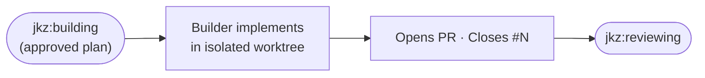

`/jkz:build <issue-number>` runs the phase where a plan becomes code. The [Builder](/agents/builder/) (Claude Opus) takes the strategy approved in [`/jkz:plan`](/commands/plan/) and implements it faithfully inside an isolated [worktree](/concepts/worktree-isolation/), then opens the pull request that every later phase reviews. It makes no architectural decisions — those were settled in planning — and it cannot reach `main`.

## What it does

The command orchestrates the **build** phase of [the pipeline](/get-started/how-jkz-works/):



- The **Builder** implements the approved plan exactly: atomic commits, matching the existing style, no opportunistic refactors.
- It works inside its own worktree — writes are confined there, never to the main checkout.
- It opens a pull request targeting `main` with a `Closes #N` (or `Fixes #N`) keyword so the eventual merge auto-closes the issue.
- It reports back a build summary (files created/modified/deleted, deviations, acceptance-criteria coverage) and a structured `jkz:verdict-json` signal: `COMPLETE` or `BLOCKED`.

When a plan step is impossible — a file was renamed, an API changed, a dependency is missing — the Builder **stops and reports `BLOCKED`** rather than fabricating success. A blocked build is a valid outcome that escalates to you, not a failure to paper over.

## When to run it

- After a plan has been approved in [`/jkz:plan`](/commands/plan/).
- As the build stage of `/jkz:pipeline`, which runs it automatically after plan approval.
- To resume an interrupted build (see below).

## Inputs

| Input | Required | Notes |
|-------|----------|-------|
| Issue number | Yes | `/jkz:build <issue-number>`. |
| Approved plan | Yes | The plan that passed Architect → Auditor → Curator. The Builder treats it as the brief. |
| Codebase context | Gathered automatically | The current state of the files the plan touches. |

In [`/jkz:quick`](/build/lightweight-routes/) there is no Architect plan: the issue body *is* the plan and the Builder implements it directly.

## Resume support

A build is resumable. If a previous run was interrupted, the command reads a `.jkz-checkpoint` in the worktree and continues from the last completed stage — committed work is never redone.

```text
planning → implementing → tested → committed → pushed → pr_created
```

## What phase it drives

| | |
|--|--|
| Phase label | `jkz:building` → `jkz:reviewing` (when the PR opens) |
| Active agent | [Builder](/agents/builder/) |
| Can open a PR | Yes |
| Can merge / push to `main` | No — blocked by capability invariants and the [merge gate](/concepts/merge-gate/) |

## Human checkpoint

The build phase has no checkpoint of its own — the human gates sit on either side: plan approval before it, and review → QA → merge after it. The Builder's only escape hatch is an honest `BLOCKED` verdict, which stops the pipeline and escalates to you.

## See also

- [How jkz works](/get-started/how-jkz-works/) — the build phase in the full pipeline flow.
- [Builder](/agents/builder/) — the agent this command dispatches.
- [`/jkz:plan`](/commands/plan/) — the phase before, which produces the approved plan.
- [`/jkz:review`](/commands/review/) — the next phase, once the PR is open.
- [Worktree isolation](/concepts/worktree-isolation/) · [Merge gate](/concepts/merge-gate/) — why the Builder is confined and cannot merge.
