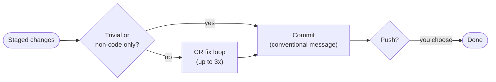

`/jkz:commit` puts a CodeRabbit review *in front of* the commit. Instead of committing first and discovering problems later in the PR, it scans the staged diff, classifies what CodeRabbit finds, applies the fixes worth applying, and only then writes the commit — so the change that lands is already cleaned up.

## Usage

```
/jkz:commit
```

It works on whatever is staged. If nothing is staged but you have unstaged changes, it asks how to stage them (`git add -A`, a selective add, or staging manually) rather than guessing.

## The flow



- **Skip heuristic.** The CodeRabbit scan is skipped when the diff is under ~10 changed lines, or when every staged file is non-code (`.md`, `.json`, `.yml`, `.lock`, and similar). Trivial changes go straight to the commit.
- **CR fix loop — up to 3 iterations.** Each pass scans the staged diff (via the CodeRabbit reviewer, falling back to the CLI wrapper), then classifies every finding as **VALID** (a real issue — gets fixed), **FALSE_POSITIVE** (dismissed with a `file:line` citation), or **LOW_SIGNAL** (informational — skipped). Valid fixes are applied surgically and re-staged. The loop ends as soon as a pass yields no valid findings, or after the third iteration.
- **Commit.** The [`commit-commands:commit`](/commands/ship/) skill writes a conventional-commit message from the staged diff. The loop never commits mid-iteration — it stages fixes and commits once at the end.
- **Push is opt-in.** Nothing is pushed unless you say so; if the branch has no upstream it uses `git push -u origin HEAD`.

## When to use it

Reach for `/jkz:commit` on ad-hoc work — outside the [pipeline](/commands/pipeline/) — when you want a quick CodeRabbit pass before committing without opening a PR first. For a fuller pre-PR sequence that also runs format, lint, tests, and simplify, use [`/jkz:ship`](/commands/ship/), which reuses this same loop. To run the loop against an *existing* PR instead of staged changes, use [`/jkz:cr-fix`](/commands/cr-fix/).

Because it only ever degrades gracefully when CodeRabbit is unavailable — warning and proceeding rather than blocking — `/jkz:commit` is safe to make a habit of.
