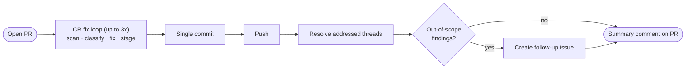

`/jkz:cr-fix` runs the CodeRabbit review-and-fix cycle against an **open pull request**. Where [`/jkz:commit`](/commands/commit/) scans staged changes before they are committed, `/jkz:cr-fix` operates on a PR that already exists: it pulls in CodeRabbit's findings (both the live CLI scan and the bot comments already on GitHub), fixes what is genuinely wrong, and tidies up the review threads.

## Usage

```
/jkz:cr-fix [<pr-number>]
```

The PR number is optional but recommended — with it, the command seeds the first iteration from existing CodeRabbit bot comments on the PR, locates the PR's worktree to run the CLI where the code lives, and pushes + resolves threads at the end. It records a rollback SHA before touching anything.

## The flow



- **Seeded from the bot.** On the first iteration the loop merges the live CodeRabbit CLI scan with the inline and PR-level comments the CodeRabbit bot already posted on GitHub — so nothing the bot flagged is missed, and a finding appearing in both sources is classified only once.
- **Five-way classification.** Every finding is labelled **VALID** (fixed), **FALSE_POSITIVE** (dismissed with a `file:line` citation), **OUT_OF_SCOPE** (a real issue in pre-existing code, not this PR — collected for a follow-up issue), **ALREADY_FIXED**, or **LOW_SIGNAL** (skipped). The loop converges as soon as a pass finds nothing valid, or after the third iteration.
- **One commit, not many.** Fixes are staged across the loop and committed once (`fix: address CodeRabbit findings`). The push is guarded — it checks the PR is still `OPEN` first — and then [resolves every addressed review thread](/concepts/merge-gate/) so the PR is clean.
- **Out-of-scope findings survive as an issue.** Before creating a follow-up issue, each out-of-scope finding is re-verified against the current code (the cited snippet must still be present); only surviving findings are written, and a duplicate open issue is never created.
- **Rollback is manual.** The loop never auto-reverts. If something went wrong, `git reset --soft <rollback-sha>` undoes every commit it made.

## When to use it

Use `/jkz:cr-fix` to clear CodeRabbit feedback on a PR — whether the PR came from the [pipeline](/commands/pipeline/) or from ad-hoc work. It is the PR-facing counterpart to the staged-changes loop in [`/jkz:commit`](/commands/commit/), and it shares the same classification discipline that the [review](/commands/review/) and [QA](/commands/qa/) phases use when they reconcile CodeRabbit findings.

:::note
`/jkz:cr-fix` fixes **multiple** findings in a loop. To accept a single CodeRabbit suggestion interactively with per-change approval, the `coderabbit:autofix` skill is the narrower tool.
:::
