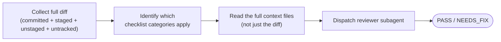

`/jkz:dev-self-review` is an internal consistency check you run *before* opening a PR. It collects everything you've changed relative to `main`, works out which parts of the jkz integration checklist apply, and dispatches a fresh reviewer subagent to read the diff as a whole — the kind of cross-file mismatch that is invisible while you're editing one file at a time.

## Usage

```
/jkz:dev-self-review
```

It reviews **all** pending changes — committed on the branch, staged, unstaged, and untracked — with no arguments. If there are no changes, it says so and exits.

## How it works



- **Deterministic diff collection.** The command unions committed (`main...HEAD`), staged, unstaged, and untracked files so nothing in flight is missed — untracked files are read in full.
- **Scope-driven checklist.** Which checklist categories are active depends on what you touched: editing `step-gate.js` activates the DEPS and checkpoint-map checks; editing command files or `review.md` / `qa.md` / `build.md` activates crash-recovery and wrapper-invocation checks; touching `CLAUDE.md`, the [rules](/reference/architecture/) files, or the docs activates documentation-sync; touching agent definitions activates the agent-capabilities check.
- **Full context, not just the patch.** The reviewer reads the *whole* files involved in an integration, because a consistency problem usually lives in the relationship between a changed line and an unchanged one.
- **Fresh subagent.** The reviewer ([`feature-dev:code-reviewer`](/agents/judge/) on Opus) does not inherit your read history — everything it needs is put in its prompt. It returns a findings table and a verdict: **PASS** (ready to open the PR) or **NEEDS_FIX** (fix and re-run).

## When to use it

Run `/jkz:dev-self-review` just before opening a PR on jkz itself — especially after a change that spans commands, rules, docs, or agent definitions, where a single edit can leave two files out of sync. It is a lighter, self-directed cousin of the pipeline's [review phase](/commands/review/): no PR is required, and the goal is to catch integration drift early rather than to gate a merge.
