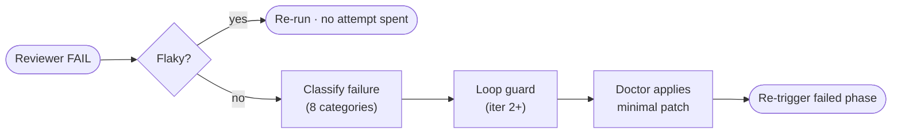

`/jkz:fix <pr-number> --source <review|qa>` is the **fix cycle**. It is rarely something you invoke by hand — `/jkz:review`, `/jkz:qa`, and [`/jkz:quick`](/commands/quick/) call it automatically whenever a reviewer returns FAIL. Its job: take the failing verdict, apply a minimal targeted fix, and re-run the phase that failed.

The agent behind it is the **[Doctor](/agents/doctor/)** (Claude Opus) — the surgeon of the pipeline. It changes exactly what broke and nothing more: no scope creep, no opportunistic refactors.

## Usage

```
/jkz:fix <pr-number> --source review   # re-run review (Judge + Inspector) after the fix
/jkz:fix <pr-number> --source qa       # re-run QA (Lens + Sentinel) after the fix
```

`--source` tells the cycle which phase failed and therefore which agents to re-trigger after the patch.

## What happens inside one cycle



1. **Gather feedback.** Collect the CRITICAL / HIGH findings from the failing verdict (compact `verdict-json` signals on later iterations, full PR comments on the first).
2. **Flaky check.** A classifier spots flaky test failures and re-runs the phase *without* counting it as a fix attempt — a flaky test should not burn the Doctor's budget.
3. **Classify the failure** into one of eight categories (implementation bug, missing validation, missing error handling, security vulnerability, missing requirement, test gap, wrong approach, regression). If the category is `wrong_approach`, a one-time gate lets the [Architect](/agents/architect/) rewrite the plan before the Doctor tries again (max one rewrite per pipeline).
4. **Loop guard.** From iteration 2 on, jkz compares the new diff against the previous attempt. A near-identical diff triggers a warning so the Doctor changes strategy instead of repeating a dead end.
5. **Fix and re-trigger.** The Doctor applies the patch and the diff goes back through the failed phase — review ([Judge](/agents/judge/) + Inspector) or QA ([Lens](/agents/lens/) + [Sentinel](/agents/sentinel/)).

This repeats **up to three attempts**. If three fixes still don't clear the verdict, the issue moves to `jkz:blocked` and escalates to you with a diagnosis of what was tried — **honest escalation over a silent hack** that merely passes the checks.

## When it fires

- **Automatically**, whenever the Judge, Inspector, Lens, or Sentinel returns FAIL during a review or QA phase.
- **Manually**, when you want to re-run the Doctor against a known-failing PR: `/jkz:fix <pr-number> --source review` (or `--source qa`).

:::note[Deep dive]
This page is the command reference. The fix cycle is covered in context alongside [`/jkz:quick`](/commands/quick/) in [Lightweight routes](/build/lightweight-routes/). Source of truth: `.claude/commands/jkz/fix.md` in the private repo.
:::
