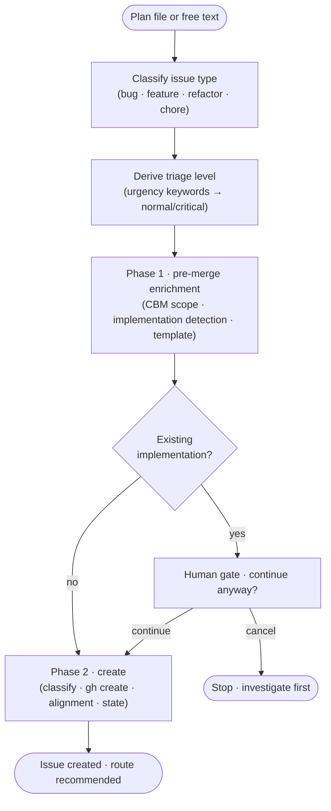

`/jkz:issue` creates a GitHub issue **directly** from a plan file or a free-text description. It is the counterpart to [`/jkz:start`](/commands/start/): where `/jkz:start` walks a conversational funnel (triage, duplicate check, targeted questions), `/jkz:issue` assumes you already know what you want and turns your input into a properly labeled, classified issue in one pass.

## Usage

```
/jkz:issue --from-plan <file>   Create an issue from a plan file
/jkz:issue <description>        Create an issue from a free-text description
```

- `--from-plan <file>` reads an existing plan file. The path is canonicalized and **must resolve inside the repository** — a trust boundary for user-supplied paths. The title is taken from the first `# ` heading, falling back to the file name.
- `<description>` takes free text directly. The title is derived from the first line.

## What it does



1. **Type classification.** The issue type (`bug` / `feature` / `refactor` / `chore`) is detected from the content and title. The type drives the label and downstream pipeline focus.
2. **Triage.** Urgency keywords (`urgent`, `blocker`, `critical`, `hotfix`, `production`, `regression`, …) bump the triage level from `normal` to `critical`.
3. **Pre-merge enrichment.** A first pass enriches the body with codebase-memory scope, selects a template, and — importantly — runs **implementation detection**: it looks for code that may already implement what the issue describes.
4. **Implementation gate.** If existing implementations are detected, `/jkz:issue` shows the matching files and asks whether to create the issue anyway. Choosing *cancel* stops so you can investigate before filing a near-duplicate of already-shipped work.
5. **Create.** The second phase classifies complexity, creates the issue via the issue primitive (baking in the `jkz:ready` label plus the type label), runs the alignment checkpoint, registers any `Blocked by: #N` relationships, and writes pipeline state.

## What you get

A new issue labeled `jkz:ready` (plus a type label and a `complexity:*` classification), and a single routing recommendation based on the classified complexity:

| Complexity | Recommendation |
|------------|----------------|
| `trivial` | Apply directly in chat — no pipeline |
| `quick` | [`/jkz:quick <N>`](/commands/quick/) — the lightweight route |
| `standard` | [`/jkz:pipeline <N>`](/commands/pipeline/) — the full pipeline |

`/jkz:plan <N>` (planning only) is always offered as an alternative. **You decide which route to take** — `/jkz:issue` files the issue and recommends, it does not start a pipeline.

:::note[Why a primitive, not raw `gh issue create`]
Issues always flow through the issue primitive so they pick up the `jkz:ready` label, the type label, the complexity classification, and the alignment checkpoint. A guard hook blocks raw `gh issue create` for exactly this reason — see [conventions](/reference/architecture/).
:::

## Related

- [`/jkz:start`](/commands/start/) — the conversational entry point that creates an issue from a vague idea.
- [`/jkz:refine`](/commands/refine/) — enrich an existing issue with a brief before planning.
