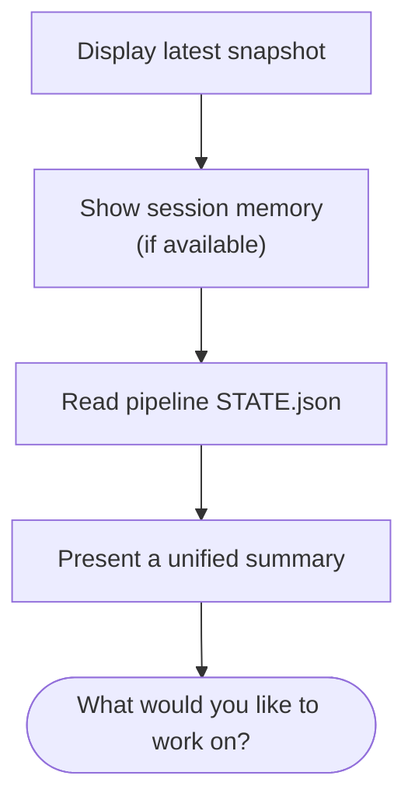

`/jkz:load` is the other half of [`/jkz:save`](/commands/save/). It retrieves the **most recent session snapshot** — typically written by another chat at shutdown — and presents it so you can continue where that session left off, with its reasoning context intact rather than reconstructed from the git log.

## Usage

```
/jkz:load
```

No arguments. `/jkz:load` finds the latest snapshot and the current pipeline state.

## What it shows



The summary pulls together, from the snapshot and pipeline state:

- **What was done** — completed work and the decisions made.
- **What worked / didn't** — approaches to keep and approaches to avoid.
- **Pipeline status** — phase and PR, from the snapshot plus `STATE.json`.
- **Next steps** — what the previous session intended to do next.
- **Gotchas** — pitfalls flagged for whoever picks the work up.
- **Git state** — branch, uncommitted changes, recent commits.

If no snapshot is found, `/jkz:load` falls back to `.claude/context.md` and presents that instead. It closes by asking what you'd like to work on.

:::note[Cross-chat continuity]
Snapshots are stored per-chat under `state/session-snapshots/`. `/jkz:load` retrieves the **most recent** one — which is usually from a *different* session, exactly the case where loading earns its keep. See [cross-chat awareness](/concepts/cross-chat/).
:::

## Related

- [`/jkz:save`](/commands/save/) — capture the snapshot that `/jkz:load` reads.
- [`/jkz:quit`](/commands/quit/) — orderly shutdown; saves the snapshot you'll later load.
