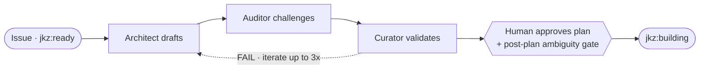

`/jkz:plan <issue-number>` runs the **first phase** of the pipeline: it turns a GitHub issue into an approved implementation strategy before a single line of code exists. The [Architect](/agents/architect/) designs the plan, the [Auditor](/agents/auditor/) attacks it, and the [Curator](/agents/curator/) calibrates that audit — iterating up to three times — and then it stops and waits for you. Nothing is built until you approve the plan.

## What it does

The command orchestrates the **plan** phase of [the pipeline](/get-started/how-jkz-works/):

- The **Architect** (Claude Opus) designs the approach: the key decisions, the scope boundaries, the files to touch, the build sequence, and the verification criteria.
- The **Auditor** (adversarial backend) challenges that plan the way a skeptic evaluates a proposal — it ignores the effort and asks what is missing, what is vague, and what will fail.
- The **Curator** (validator backend) validates the audit itself, catching miscalibrated severities and false positives.

This repeats up to **three iterations**. Each handoff is a Git artifact — the plan and every review land as comments on the issue, never as a direct conversation between agents.

## When to run it

- Before any build, on a `standard`-complexity issue that needs a design decision documented and reviewed.
- When you want a human checkpoint on the approach before committing engineering effort.
- As the first stage of `/jkz:pipeline`, which chains plan → build → review → QA automatically.

For trivial or quick-complexity work, skip planning entirely and use [`/jkz:quick`](/build/lightweight-routes/) (Builder + Judge, no plan).

## Inputs

| Input | Required | Notes |
|-------|----------|-------|
| Issue number | Yes | `/jkz:plan <issue-number>`. If no issue exists yet, create one first. |
| Issue body + labels | Read automatically | The requirements, type label, and any `complexity:*` label. |
| Codebase context | Gathered automatically | The Architect uses Glob/Grep to find and read the files relevant to the task. |
| Dependency blockers | Checked automatically | A `Blocked by: #N` relationship on an open issue surfaces as a warning before planning. |

The command enters an isolated per-issue [worktree](/concepts/worktree-isolation/) before doing any work.

## What phase it drives

| | |
|--|--|
| Phase label | `jkz:ready` → `jkz:planning` → `jkz:building` (on approval) |
| Iterations | Up to 3 (Architect → Auditor → Curator), then escalate or checkpoint |
| Active agents | [Architect](/agents/architect/), [Auditor](/agents/auditor/), [Curator](/agents/curator/) |

## How issue type changes the plan

The Architect's focus shifts with the issue's type label:

| Type | Plan focus |
|------|-----------|
| `feature` | Implementation design |
| `bug` | Root-cause analysis |
| `refactor` | Current → target state |
| `chore` | Mechanical change |

## Human checkpoint

The plan phase ends at a **mandatory human checkpoint** — one of the few points where the pipeline hands control back to you:

1. **Post-plan ambiguity gate.** An Opus scan classifies any ambiguity as `TRIVIAL`, `FIX`, or `DECIDE`. A `DECIDE` item needs your call before approval.
2. **Plan approval.** Unlike the review and QA checkpoints, the plan *is* the artifact under review — so it is displayed in full in the chat. You read it and approve it. Approval transitions the issue to `jkz:building`; nothing is built until you do.

## See also

- [How jkz works](/get-started/how-jkz-works/) — the plan phase in the full pipeline flow.
- [Architect](/agents/architect/) · [Auditor](/agents/auditor/) · [Curator](/agents/curator/) — the three agents this command dispatches.
- [`/jkz:build`](/commands/build/) — the next phase, once the plan is approved.
- [Lightweight routes](/build/lightweight-routes/) — `/jkz:quick` when a change is too small to plan.
- [CLI / commands](/reference/cli/) — every `/jkz:*` command at a glance.
