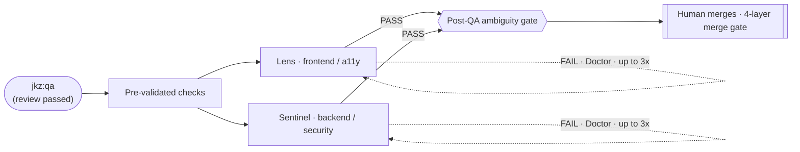

`/jkz:qa <pr-number>` runs the final review phase before merge. [Lens](/agents/lens/) (validator backend) and [Sentinel](/agents/sentinel/) (adversarial backend) review the pull request **in parallel** — Lens owns what the user sees, Sentinel owns the operation and the attack surface. A FAIL routes to the [Doctor](/agents/doctor/), up to three times. QA is required for features and optional for smaller changes.

## What it does

The command orchestrates the **QA** phase of [the pipeline](/get-started/how-jkz-works/):

- **Lens** owns the frontend: visual fidelity, multimodal output, and accessibility.
- **Sentinel** owns the operation: backend integrity, security posture, performance, and infrastructure.
- They run **in parallel** — the one case where two agents work the same issue at once.
- A FAIL from either routes to the [Doctor](/agents/doctor/) for a surgical fix, then back through QA, up to three attempts.
- After a PASS, a CR reconciliation closes out any remaining CodeRabbit-bot findings.

## When to run it

- After [`/jkz:review`](/commands/review/) passes, for any `feature` issue.
- As the QA stage of `/jkz:pipeline`, which runs it automatically after review.

QA is **required** for `feature` issues and **optional** for `bug`, `refactor`, and `chore` — small, scoped changes can skip it.

## Inputs

| Input | Required | Notes |
|-------|----------|-------|
| PR number | Yes | `/jkz:qa <pr-number>`. The PR should have passed `/jkz:review`. |
| PR diff | Read automatically | Lens and Sentinel receive the full diff. |
| Pre-validated checks | Computed automatically | Deterministic findings injected into the Sentinel prompt. |

## What phase it drives

| | |
|--|--|
| Phase label | `jkz:qa` → `jkz:approved` (PASS) or `jkz:fixing` (FAIL) |
| Iterations | Up to 3 Doctor fix cycles on FAIL |
| Active agents | [Lens](/agents/lens/), [Sentinel](/agents/sentinel/), [Doctor](/agents/doctor/) on FAIL |
| Parallelism | Lens and Sentinel run concurrently |

## Human checkpoint

QA ends at the **last two human-facing gates** before code reaches `main`:

1. **Post-QA ambiguity gate.** The same Opus scan as the plan phase runs again — classifying ambiguities as `TRIVIAL`, `FIX`, or `DECIDE` — surfacing anything that needs your decision after QA.
2. **The merge.** Only you merge to `main`. The [merge gate](/concepts/merge-gate/) enforces this server-side in four layers; no session can self-merge.

## See also

- [How jkz works](/get-started/how-jkz-works/) — the QA phase in the full pipeline flow.
- [Lens](/agents/lens/) · [Sentinel](/agents/sentinel/) · [Doctor](/agents/doctor/) — the agents this command dispatches.
- [`/jkz:review`](/commands/review/) — the phase before, which gates entry to QA.
- [Merge gate](/concepts/merge-gate/) — the four-layer guarantee that only a human merges.
- [CLI / commands](/reference/cli/) — every `/jkz:*` command at a glance.
