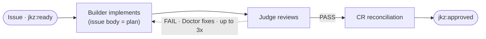

`/jkz:quick <issue-number>` runs the **smallest pipeline jkz has**: two agents, one reviewer, no plan, no QA. It is the route for changes that are too small to justify an Architect, an Auditor, and a QA pass — a one-line fix, a doc edit, a config tweak — but still deserve a review and the merge gate.

## Usage

```
/jkz:quick <issue-number>
```

The issue number is required. If the issue has no `complexity:*` label, `/jkz:quick` classifies it on the spot; if it comes back `standard`, it warns you and offers the full `/jkz:pipeline` before doing anything.

## The flow



- **No Architect.** There is no formal plan — *the issue description is the plan*. The [Builder](/agents/builder/) reads the issue and implements it directly inside an isolated [worktree](/concepts/worktree-isolation/), then opens the PR.
- **The [Judge](/agents/judge/) is the sole reviewer.** It reviews the diff against the issue body, with no CodeRabbit pre-scan and no Inspector — calibrated to the small scope.
- **No QA phase.** Lens and Sentinel do not run.
- **CR reconciliation runs only after a PASS.** CodeRabbit-bot findings are triaged lightweight (VALID / FALSE_POSITIVE / OUT_OF_SCOPE / ALREADY_FIXED); VALID fixes are applied directly and the Judge re-reviews once.
- **On FAIL, the [Doctor](/agents/doctor/) fixes — up to 3 times.** Three failed attempts move the issue to `jkz:blocked` and escalate to you.

Everything else holds: the change runs in a per-issue worktree, the PR closes the issue via a `Closes`/`Fixes` keyword, and **only a human merges** — the lightweight route does not weaken the [merge gate](/concepts/merge-gate/).

## When to use it

| Use it for | Do **not** use it for |
|------------|-----------------------|
| Fixes of roughly 1–10 lines | New features |
| Documentation-only changes | Architectural changes |
| Config changes with obvious scope | Security-sensitive code |
| Typo fixes, minor refactors | Anything touching more than ~5 files |

If a change has any of the right-hand qualities, reach for the full `/jkz:pipeline` instead.

:::note[Deep dive]
This page is the command reference. For how the complexity classifier decides whether you land here, and how `/jkz:quick` relates to the [`/jkz:fix`](/commands/fix/) cycle, see [Lightweight routes](/build/lightweight-routes/).
:::
