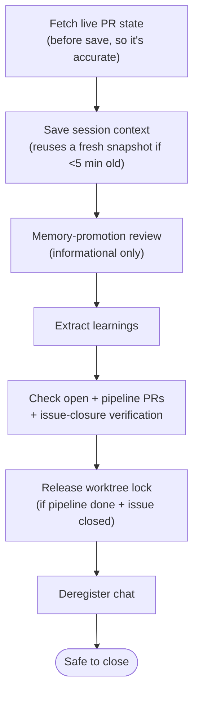

`/jkz:quit` performs an **orderly shutdown**: it preserves context for the next chat, surfaces what's still in flight, and cleanly deregisters this session from the [cross-chat registry](/concepts/cross-chat/). It does not close the window for you — it leaves you informed and lets you close when ready.

## Usage

```
/jkz:quit
```

No arguments.

## What it does



1. **Fetch live PR state first.** Open PRs and the pipeline PR are fetched from GitHub *before* writing context, so the saved state reflects reality rather than stale conversational memory.
2. **Save context.** `/jkz:quit` runs [`/jkz:save`](/commands/save/) internally — you do **not** need to call it separately. If a snapshot from this session is already fresh (under 5 minutes old), it reuses it instead of re-capturing.
3. **Memory-promotion review.** A deterministic filter looks for memory-promotion candidates and classifies them with Haiku. Results are shown as information only — quit never blocks or waits for input. Act on them later with `/jkz:memory-promote` if you choose.
4. **Extract learnings.** Learnings are extracted from the snapshot, fail-open.
5. **Check PRs.** A combined table shows the pipeline PR (even if merged) and other open PRs, with merge-state status (`CLEAN`, `DIRTY`, `BLOCKED`, `UNKNOWN`). For a merged pipeline PR, it verifies that the `Closes/Fixes/Resolves #N` issues actually closed — and **warns** if an issue is still open after merge.
6. **Release a finished worktree lock.** If the current directory is an issue worktree, the pipeline reached `approved`/`completed`, **and** the owning issue is `CLOSED`, the worktree lock is released so cleanup can reclaim it without waiting for the 24-hour stale-lock sweep. All three conditions are required; otherwise the lock is preserved.
7. **Deregister the chat** from the active-chat registry.

## What it tells you at the end

- Context was saved (snapshot + `.claude/context.md`).
- The chat was deregistered.
- A PR status summary.
- Any background tasks still in flight (crons, plus a note for non-enumerable background work).
- That you can safely close the window.

:::caution[Run it from the worktree]
If you're working inside an issue worktree, run `/jkz:quit` **from that worktree directory**, not the parent repo — that's where the lock-release check runs, so it can reclaim the worktree once the pipeline is done.
:::

## Related

- [`/jkz:save`](/commands/save/) — the context save that `/jkz:quit` runs internally.
- [`/jkz:load`](/commands/load/) — how the next session picks up what `/jkz:quit` saved.
- [Cross-chat awareness](/concepts/cross-chat/) — why orderly shutdown matters with parallel chats.
