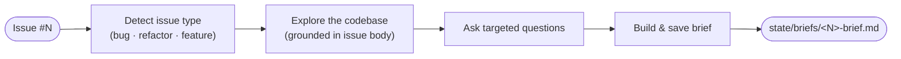

`/jkz:refine` is the bridge between a thin issue and a plannable one. It runs a **lightweight pre-plan refinement**: it explores the relevant code, asks you a small budget of targeted questions based on what it actually found, and produces a structured **brief** that downstream agents pick up automatically — so the [Architect](/agents/architect/) starts planning with context instead of guessing.

## Usage

```
/jkz:refine <issue-number>
```

The issue number is required. `/jkz:refine` reads the issue's title, body, and labels to seed the refinement.

## How it works



1. **Detect the issue type.** Labels decide the type, with `bug` winning over `refactor`, which wins over the `feature` default. The type shapes how exploration and questions are framed.
2. **Explore.** `/jkz:refine` reads the code referenced by the issue body — it grounds its questions in the real codebase rather than asking in the abstract.
3. **Ask targeted questions.** Questions are generated from what exploration surfaced, sized to the issue. The point is to resolve ambiguity *before* a plan is drawn, not after.
4. **Build and save the brief.** Your answers plus the exploration notes become a structured brief saved to `state/briefs/<N>-brief.md`, keyed by a hash of the issue body so staleness can be detected later.

## What you get

A brief written to `state/briefs/<N>-brief.md`. The next step is [`/jkz:plan <N>`](/commands/plan/) — the Architect reads the brief **automatically**, so the refinement carries forward without you having to paste anything.

If the issue body is sparse (under ~50 words), `/jkz:refine` offers to post the brief as a comment on the issue for traceability.

:::note[refine vs. start]
[`/jkz:start`](/commands/start/) refines a *vague idea* into a brand-new issue. `/jkz:refine` refines an *existing issue* that already has a number. Reach for `refine` when an issue was filed thin and needs sharpening before the pipeline runs.
:::

## Related

- [`/jkz:plan`](/commands/plan/) — consumes the brief to design the implementation.
- [`/jkz:start`](/commands/start/) — the conversational front door that also refines, but for new ideas.
