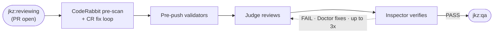

`/jkz:review <pr-number>` runs the phase that scrutinizes the Builder's diff before it can reach QA. The [Judge](/agents/judge/) (adversarial backend) reviews the pull request assuming there *is* a bug, and the [Inspector](/agents/inspector/) (validator backend) is the precision filter on that review. A failing verdict does not reach you — it routes straight to the [Doctor](/agents/doctor/)'s fix cycle, up to three times.

## What it does

The command orchestrates the **review** stage of the build phase in [the pipeline](/get-started/how-jkz-works/):

- A **CodeRabbit pre-scan** and fix loop catch the obvious issues first.
- **Pre-push validators** run deterministic checks on the diff (secrets, leftover debug statements, capability invariants) and feed the results to the Judge as Level-1 evidence it should not re-flag.
- The **Judge** chaos-engineers the diff against the approved plan: it assumes a bug exists and asks how the code fails.
- The **Inspector** verifies the Judge's findings — edge cases and execution claims — filtering out noise and confirming what's real.
- After a **PASS**, a CR reconciliation triages any remaining CodeRabbit-bot findings (VALID / FALSE_POSITIVE / OUT_OF_SCOPE / ALREADY_FIXED) before the issue advances.

On a **FAIL**, the [Doctor](/agents/doctor/) applies a minimal targeted fix and the diff goes back through review — up to three attempts before the pipeline escalates to a human.

## When to run it

- After [`/jkz:build`](/commands/build/) has opened the PR.
- As the review stage of `/jkz:pipeline`, which runs it automatically after the build.

## Inputs

| Input | Required | Notes |
|-------|----------|-------|
| PR number | Yes | `/jkz:review <pr-number>`. The PR should have been created by `/jkz:build`. |
| PR diff | Read automatically | The Judge and Inspector receive the full diff plus the approved plan. |
| Pre-validated checks | Computed automatically | Deterministic findings injected into the Judge's prompt. |

## What phase it drives

| | |
|--|--|
| Phase label | `jkz:reviewing` → `jkz:qa` (PASS) or `jkz:fixing` (FAIL) |
| Iterations | Up to 3 Doctor fix cycles on FAIL |
| Active agents | [Judge](/agents/judge/), [Inspector](/agents/inspector/), [Doctor](/agents/doctor/) on FAIL |

## How issue type changes the review

| Type | Review focus |
|------|-------------|
| `feature` | Code quality |
| `bug` | Fix correctness |
| `refactor` | Behavior preserved |
| `chore` | No behavior shift |

## Human checkpoint

Review is an internal gate, not a human checkpoint — its job is to catch problems automatically. A FAIL routes to the Doctor rather than to you; the human decision points sit at plan approval (before) and the post-QA gate plus the merge (after). The pipeline escalates to you only if three fix attempts cannot clear the verdict.

## See also

- [How jkz works](/get-started/how-jkz-works/) — the review stage in the full pipeline flow.
- [Judge](/agents/judge/) · [Inspector](/agents/inspector/) · [Doctor](/agents/doctor/) — the agents this command dispatches.
- [`/jkz:build`](/commands/build/) — the phase before, which opens the PR.
- [`/jkz:qa`](/commands/qa/) — the next phase, once review passes.
- [Lightweight routes](/build/lightweight-routes/) — `/jkz:fix`, the Doctor's fix cycle invoked on a FAIL.
