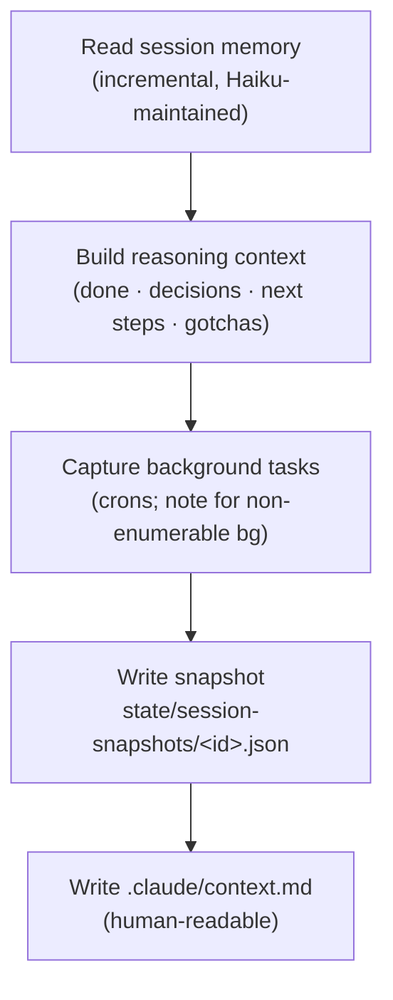

`/jkz:save` preserves the **reasoning context** of the current session so it survives the chat window. It writes two things: a structured snapshot (consumed by [`/jkz:load`](/commands/load/)) and a human-readable `.claude/context.md`. Because multiple Claude Code chats can run on the same project, saving is how knowledge crosses between them — see [cross-chat awareness](/concepts/cross-chat/).

## Usage

```
/jkz:save
```

No arguments. `/jkz:save` reads the current session and captures everything relevant.

## What it captures



1. **Session memory as the base.** Any incrementally maintained session memory seeds the snapshot, then is enriched with what this session adds.
2. **Reasoning context.** A concise record of what was completed, the decisions made (with rationale), what worked and what didn't, the next steps, and the gotchas to watch for.
3. **Background tasks (best-effort).** Crons are enumerable and recorded. Background subagents and background bash shells are *not* enumerable — they live inside the session and die when it closes — so if any were started, they're noted as free text rather than dropped silently.
4. **The snapshot** is written per-session to `state/session-snapshots/<session-id>.json`.
5. **`.claude/context.md`** holds the same information in a short, human-readable form (10–20 lines): what was worked on, current state, key decisions, and active branches.

## Why it matters

A snapshot is what lets a *different* chat run [`/jkz:load`](/commands/load/) and continue your work with full reasoning context — not just the git state. The session id keys the snapshot; if it is unset, the snapshot falls back to `anonymous`, which weakens cross-chat continuity and token attribution.

:::note[You rarely call this directly]
[`/jkz:quit`](/commands/quit/) runs `/jkz:save` internally as its first step, so an orderly shutdown already captures context. Call `/jkz:save` on its own when you want a mid-session checkpoint without quitting.
:::

## Related

- [`/jkz:load`](/commands/load/) — retrieve the most recent snapshot from another session.
- [`/jkz:quit`](/commands/quit/) — orderly shutdown that saves, then deregisters the chat.
