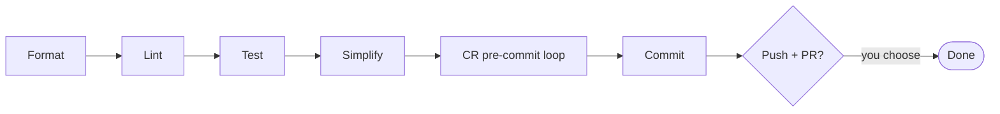

`/jkz:ship` is the full pre-PR sequence for work done *outside* the [pipeline](/commands/pipeline/). It takes the current branch through format → lint → test → simplify → CodeRabbit pre-commit → commit, then optionally pushes and opens a PR. No issue, no pipeline state, no agents — just the quality gates applied to whatever you've been editing.

## Usage

```
/jkz:ship [--skip-tests] [--skip-simplify]
```

| Flag | Effect |
|------|--------|
| *(none)* | Full sequence: format, lint, test, simplify, CR pre-commit, commit |
| `--skip-tests` | Skip the test step |
| `--skip-simplify` | Skip the simplify step |

It refuses to run on `main` — you must be on a feature branch with changes to process.

## The sequence



- **Format & lint** run over the modified files only (the staged + unstaged union), per directory, via `quality-scan.js`. If the scanner is unavailable the step warns and continues rather than aborting. Files touched by these steps are re-staged.
- **Test** runs `npm test` (not the runner directly, so it inherits the notification kill-switch). On failure it stops and asks whether to continue or abort — it never silently ships failing code. Skipped with `--skip-tests`.
- **Simplify** reviews staged code files for unnecessary complexity and applies refinements that change *how*, not *what* — preserving behavior. Non-code files are skipped, as is the whole step under `--skip-simplify`.
- **CR pre-commit + commit** reuse the [`/jkz:commit`](/commands/commit/) loop: the same skip heuristic, the same up-to-three-iteration CodeRabbit classify-and-fix cycle (VALID / FALSE_POSITIVE / LOW_SIGNAL), and the same conventional-commit skill at the end.
- **Push + PR is opt-in.** When you confirm, it pushes with `git push -u origin HEAD` and opens a PR with `gh pr create --fill`. Declining leaves you with a clean local commit and a summary of what ran.

## When to use it

`/jkz:ship` is for ad-hoc branches that never entered the pipeline but still deserve the same quality bar before a PR — a quick fix, a docs sweep, a small refactor you made directly. It composes the [`/jkz:commit`](/commands/commit/) loop with the quality scans and tests; if you only want the CodeRabbit-before-commit step, reach for `/jkz:commit` alone, and if you want to clear CodeRabbit feedback on an *existing* PR, use [`/jkz:cr-fix`](/commands/cr-fix/).

Like the rest of jkz, it stops short of the merge: shipping here means *ready for review*, and [only a human merges](/concepts/merge-gate/).
