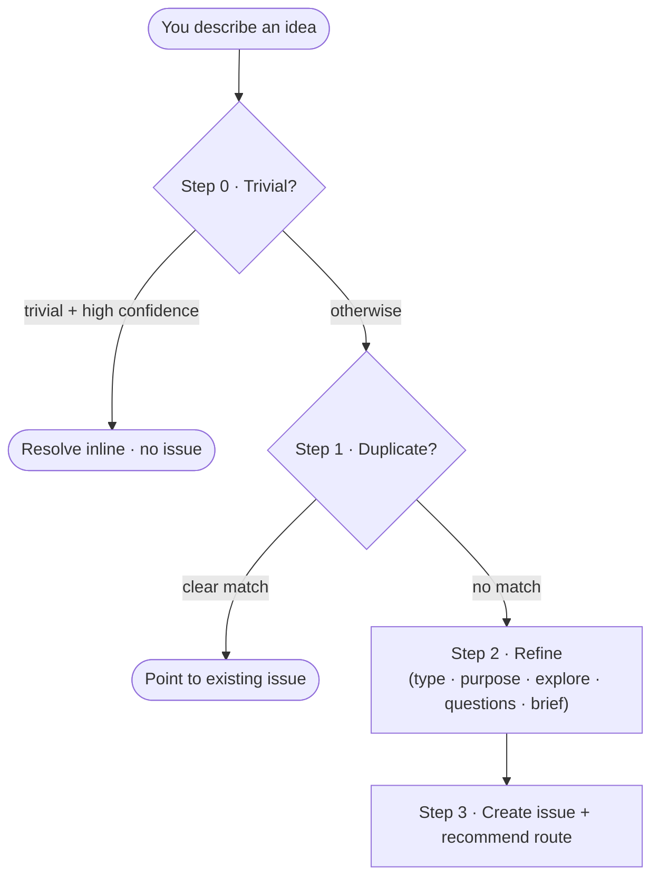

`/jkz:start` is the front door. You do not need an issue number — *this command creates the issue*. You bring a rough idea ("the bot should show pipeline cost", "something's off with notifications", "let's add a retry to the webhook handler") and jkz turns it into a well-formed, labeled issue with a recommended route, without you having to know whether the work is trivial, quick, or standard.

## Usage

```
/jkz:start
```

No arguments. jkz asks you to describe what you want, then walks a short routing funnel.

## How it routes you

`/jkz:start` walks four steps in order and **stops at the first match** — so it never spends effort exploring the codebase or drafting a brief for work that does not need a pipeline.



1. **Triage.** A Haiku classifier sizes the idea. If it comes back `trivial` *with high confidence*, jkz offers to resolve it inline in the chat — no issue, no pipeline. (Low confidence always continues to refinement; jkz reads the code before deciding.)
2. **Duplicate check.** jkz searches open `jkz:ready` issues. If one clearly matches, it points you there instead of creating a near-duplicate.
3. **Refinement.** jkz classifies the issue type (`bug` / `feature` / `refactor` / `chore`), extracts the purpose (asking one clarifying question if the intent is vague), explores the relevant code, and asks a small budget of targeted questions sized to the provisional complexity. The answers become a structured **brief**.
4. **Issue creation + recommendation.** jkz creates the issue via the issue primitive — baking in the `jkz:ready` label, the type label, and a `complexity:*` classification, and running its alignment checkpoints inline. Then it recommends a route.

## What you get at the end

A new issue labeled `jkz:ready`, a brief saved under `state/briefs/`, and a single clear recommendation based on the classified complexity:

| Complexity | Recommendation |
|------------|----------------|
| `trivial` | Apply directly, or [`/jkz:quick`](/commands/quick/) |
| `quick` | [`/jkz:quick`](/commands/quick/) — the [lightweight route](/build/lightweight-routes/) |
| `standard` | `/jkz:pipeline` — the full plan → build → review → QA loop |

You always decide which route to take — jkz recommends, it does not act on its own. `/jkz:plan` (planning only) is offered as an alternative in every case.

:::note[Source of truth]
The behavior summarized here lives in the private repo at `.claude/commands/jkz/start.md`, and complexity classification in `scripts/classify-issue.js`. This page is the public reference.
:::

## When to use `/jkz:start`

- You have an idea but no issue yet, and you are not sure how big the work is.
- You want jkz to size the change and route you, rather than guessing between quick and the full pipeline yourself.

If you already have a GitHub issue, skip straight to [`/jkz:quick`](/commands/quick/) for small scoped work or `/jkz:pipeline` for anything with design decisions. For the full picture of how the pipeline runs after an issue exists, see [How jkz works](/get-started/how-jkz-works/).
