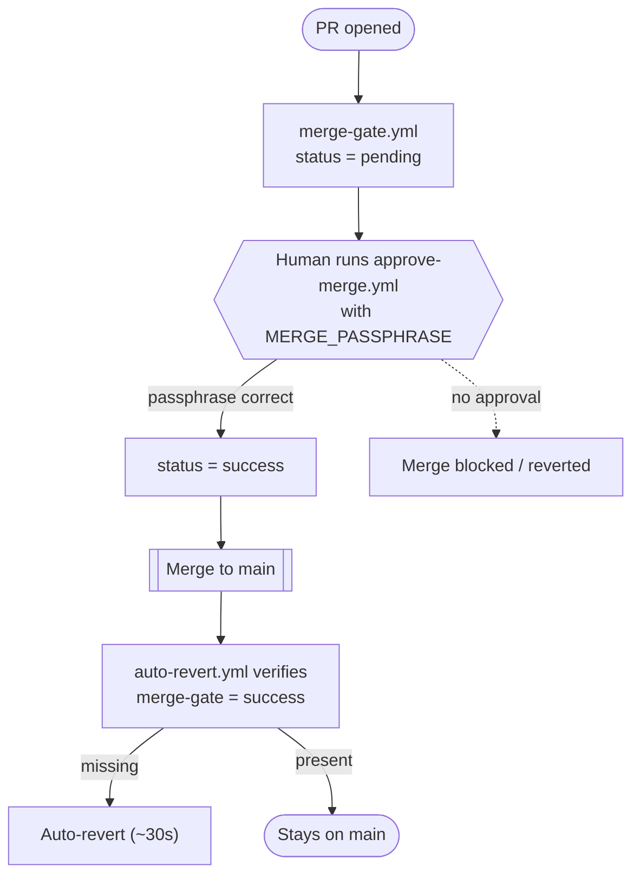

jkz iterates on its own — up to three times per phase — but it cannot reach `main`. You do that, and only you. This is the system's single hardest invariant, and it is not enforced by a prompt. Prompts can be argued with, and past incidents reached production through an agent self-merge. So the merge gate is **server-side**, in four layers, with a fifth pre-flight gate guarding the step just before approval.

## Why it is structural, not advisory

A rule like "agents must not merge" is only as strong as the model's willingness to follow it. The merge gate replaces that willingness with mechanism: three of its four layers live in GitHub Actions and GitHub Secrets, where a Claude Code session has no reach at all. Even a session running with elevated permissions cannot read the secret that unlocks a merge, and any merge that slips through without approval is reverted automatically. The guarantee — *you stay the final arbiter* — is built into the infrastructure, not requested of the agent.

## The four layers

| Layer | Mechanism | Bypassable? |
|-------|-----------|-------------|
| `merge-gate.yml` | Sets commit status `pending` on every PR. | No — server-side |
| `approve-merge.yml` | A `workflow_dispatch` with a passphrase (`MERGE_PASSPHRASE`, a GitHub Secret) flips the status to `success`. | No — Claude Code cannot read GitHub Secrets |
| `auto-revert.yml` | Detects any merge lacking `merge-gate=success` and reverts it automatically (~30s). | No — server-side |
| `guard-destructive.sh` | Blocks `gh pr merge`, `gh workflow run approve-merge`, and `gh api .../statuses/` locally. | Yes — only with `bypassPermissions`, which is exactly why layers 1–3 exist |



The first three layers are server-side and cannot be touched from inside a session. The fourth, `guard-destructive.sh`, is a local convenience that stops the dangerous commands before they ever run — useful, but explicitly *not* the thing the guarantee rests on. That is why the rule is absolute: running Claude Code with `--permission-mode bypassPermissions` is a severe violation precisely because it disables layer 4, leaving only the server-side layers as the safety net.

## How a merge actually happens

Merging is a deliberate, two-step act performed by you — from your terminal, not from Claude Code:

```bash
# 1. Approve (the passphrase lives only in your head / GitHub Secrets)
gh workflow run approve-merge.yml -f pr=<NUMBER> -f passphrase=<your-passphrase>

# 2. Merge from the PR button on GitHub, or:
gh pr merge <NUMBER>
```

`scripts/check-merge-gate.sh --pr <N>` reports the current gate status by the PR's head SHA and is surfaced in `/jkz:status`, so you can always see whether a PR is still `pending` or has been approved.

## The CodeRabbit pre-flight gate

One more gate sits *before* approval, at the transition into `jkz:approved`: `cr-preflight-gate.sh`. Its job is narrower — it refuses to let a PR be marked approved while CodeRabbit review threads are still **unresolved without either a human reply or commit coverage**. It exists so that a bot's findings are never silently skipped on the way to the merge checkpoint.

For each unresolved thread opened by an allow-listed bot login, the gate decides whether it has been *addressed*:

- **Human reply** — a non-bot comment posted after the bot's, OR
- **Commit coverage** — a commit made *after* the finding that touches the same file (and, for a line-anchored finding, a line within the patch's changed range).

A thread with neither is a blocker. The gate's exit codes are precise:

| Exit | Meaning |
|------|---------|
| `0` | All CR threads have a reply or coverage (or there are none) — proceed |
| `1` | Blocked — one or more unresolved threads without reply or coverage |
| `2` | Fail-open — a GraphQL/API infrastructure error; the caller continues with a warning |
| `3` | Bad arguments |

It is deliberately **fail-open** on infrastructure errors (exit 2): a flaky GitHub API must never wedge the pipeline. When it genuinely blocks (exit 1), it prints each offending thread's URL, path, and summary so you know exactly what to reply to. To override — for a finding you've judged a false positive, or in an emergency — use `--force` on the transition, or set `JKZ_CR_GATE_DISABLE=1`.

## Why this matters

The merge gate is the structural expression of jkz's core promise: augmented engineering with you as the final arbiter. Everything upstream — the [worktree](/concepts/worktree-isolation/) each branch is built in, the [cross-chat](/concepts/cross-chat-awareness/) coordination that keeps sessions apart — exists to deliver a clean, reviewed PR *to this gate*. And here the autonomy stops. The pipeline can build and challenge and fix, but the one action it can never take is the one that ships. That stays yours.
