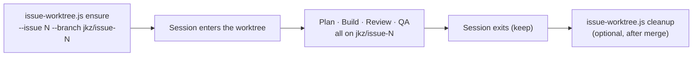

jkz runs many things at once: several issues in flight, several Claude Code chats open, and inside a single phase, subagents that write to disk in parallel. None of them can be allowed to step on each other's files. The answer is the same primitive Git already gives you — the **worktree**, a second working directory attached to the same repository, checked out on its own branch. jkz leans on it twice, at two different scales, and wraps both in a lifecycle that knows how to create, lock, and reclaim them safely.

## Two layouts, two lifetimes

There are two distinct kinds of worktree in the system, and they are easy to confuse because they solve adjacent problems.

| Kind | Where it lives | Branch | Lifetime | Created by |
|------|----------------|--------|----------|------------|
| **Issue worktree** | `../jkz-worktree-<N>` (sibling of the main repo) | `jkz/issue-<N>` | Long-lived — one per issue, persists across phases | `issue-worktree.js ensure` |
| **Agent worktree** | `.claude/worktrees/agent-*` (inside the repo) | `worktree-agent-<id>` | Ephemeral — created and discarded per Task | Claude Code's Task tool (`isolation: "worktree"`) |

The **issue worktree** is the home for a single issue's whole journey — plan, build, review, QA all happen on the same `jkz/issue-<N>` branch in the same sibling directory. It is the unit a chat session "owns" (see [Cross-chat awareness](/concepts/cross-chat-awareness/)).

The **agent worktree** is much smaller in scope: when a phase dispatches a subagent that needs to write files (the Builder, the Doctor), Claude Code can hand that subagent its own throwaway checkout so two agents writing in parallel never corrupt each other's tree. These are managed entirely by Claude Code and removed when the Task ends.

## The issue-worktree lifecycle

Every pipeline command (`/jkz:plan`, `/jkz:build`, `/jkz:qa`, `/jkz:pipeline`, `/jkz:quick`) enters an isolated worktree before doing any work and leaves it intact when the phase ends:

`ensure` is **idempotent** — it is safe to call on every phase. The first call creates the worktree at `../jkz-worktree-<N>` on branch `jkz/issue-<N>` from `main`; later calls find the existing one and simply re-prepare it. Concretely, `ensure`:

- Creates (or reuses) the sibling directory and its branch.
- On a brand-new branch, makes an **empty marker commit** (`chore(jkz): open worktree for #<N>`) so the branch has at least one commit over `main`. Without it, a fresh branch with zero commits ahead can be misread as "already merged" and reclaimed by cleanup.
- **Locks** the worktree with the reason `jkz pipeline #<N>`, signalling that a pipeline owns it.
- Symlinks `node_modules` from the main repo so hooks can load npm modules without a reinstall, and copies `.env` and `.claude/settings.local.json` into the worktree so configuration follows the work.

### The skip guard

jkz does not blindly nest worktrees. Before entering one, the pipeline checks whether the session is *already* isolated and yields if so:

- If the current Git root's basename matches `jkz-worktree-*`, the session is already inside an issue worktree — skip.
- If `JKZ_USE_CC_WORKTREES=1` (the default) **and** the Git root path contains `/.claude/worktrees/`, Claude Code has already isolated the session via its own Task or Agent-view isolation — skip and defer to it.

Set `JKZ_USE_CC_WORKTREES=0` to force jkz sibling worktrees in every context. This guard is what prevents double-entry when commands pseudo-include one another.

## Cleanup safety

Reclaiming worktrees is the dangerous half of the lifecycle — a careless `rm -rf` can destroy unmerged work. jkz makes cleanup conservative on purpose.

The per-issue `issue-worktree.js cleanup` refuses to remove a worktree that has **uncommitted changes** or whose branch is **not yet merged**, unless you pass `--force`. The batch sweep `worktree.sh cleanup-merged` goes further:

- It is **dry-run by default** — you must pass `--apply` for it to delete anything.
- It refuses any worktree that is jkz-locked, has uncommitted changes, or is referenced by a fresh chat-registry heartbeat from another live session.
- Deleted worktrees are **moved to `state/worktree-trash/`**, not `rm -rf`'d, and remain recoverable.
- Kill-switch: `JKZ_WORKTREE_CLEANUP_DISABLE=1` makes cleanup a no-op even with `--apply`.

:::caution[Scaling reality]
Worktrees are cheap individually but accumulate. After a long run with dozens of merged issues you can find a large backlog of sibling and agent worktrees; around the order of ~80 concurrent worktrees, Git contention starts to show. Run the dry-run sweep first, confirm what it would remove, then `--apply`.
:::

### Stale-lock recovery

A locked worktree whose issue has been closed should not stay locked forever. The monitoring loop's stale-lock sweep recovers worktrees whose owning issue has been **CLOSED for at least `JKZ_STALE_LOCK_CLOSED_HOURS`** (default 24), using two-cycle confirmation so a transient lookup error never triggers a delete. The "safe to unlock" decision is tri-state: only a definitive "no active session" answer unlocks; an active session *or* a lookup error both fail safe and leave the lock in place. Kill-switch: `JKZ_STALE_LOCK_SWEEP_DISABLE=1`.

## Why this matters

Isolation is what lets jkz be parallel without being chaotic. Each issue has a branch and a directory that nothing else touches; each file-writing subagent gets a tree of its own; and the cleanup machinery is built to fail toward *keeping* work rather than losing it. The same registry that records which worktree a session owns is the basis for [Cross-chat awareness](/concepts/cross-chat-awareness/) — and the branch that lives in each worktree is the one that eventually faces the [Merge gate](/concepts/merge-gate/) before it can reach `main`.
