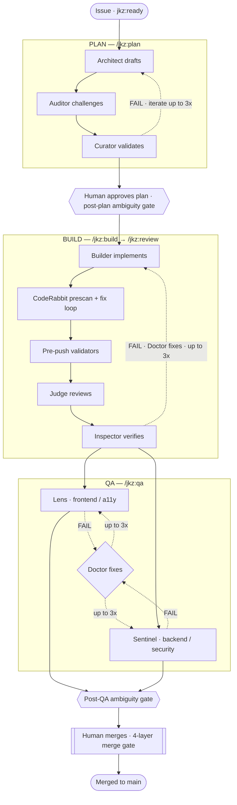

jkz turns one issue into one merged pull request through three phases — **plan**, **build**, and (for features) **QA** — staffed by twelve specialized roles. In each phase Opus drafts the work, an adversarial backend tries to break it, and a validator backend confirms the verdict. Agents never talk to each other: every handoff is a Git artifact (a plan comment, a PR diff, a review comment). The pipeline iterates on its own up to three times per phase, but it cannot reach `main`. You do that, and only you.

## The pipeline at a glance

The dotted edges are iteration loops. A failing verdict sends the work back — to the Architect in planning, to the Doctor in build and QA — for up to three attempts. Exhaust those and the pipeline stops and escalates to you rather than forcing a fix that merely passes the checks.

## The three phases

### Plan — `/jkz:plan`

The **Architect** designs the implementation strategy: the *why* before the *how*, the scope boundaries before a single line of code. The **Auditor** then challenges that plan the way a CEO evaluates a proposal — it ignores the effort and asks what is missing, what is vague, and what will fail. The **Curator** validates the audit itself, catching miscalibrated severities and false positives. Up to three iterations, then a **human checkpoint**: you read the plan and approve it. Nothing is built until you do.

### Build — `/jkz:build` → `/jkz:review`

The **Builder** implements the approved plan inside an isolated worktree and opens a pull request. A CodeRabbit prescan and fix loop catch the obvious issues first, then pre-push validators run deterministic checks (secrets, leftover debug statements, capability invariants). The **Judge** reviews the diff as a chaos engineer — it assumes there *is* a bug and asks how the code fails. The **Inspector** is the precision filter on that review, verifying edge cases and execution claims. On a FAIL the **Doctor** performs a surgical fix — exactly what broke, nothing more — and the diff goes back through review, up to three times.

### QA — `/jkz:qa`

**Lens** and **Sentinel** run in parallel. Lens owns the frontend: visual fidelity, multimodal output, and accessibility. Sentinel owns the operation: backend integrity, security posture, performance, and infrastructure. A FAIL routes to the **Doctor** again, up to three times. QA is **required** for features and **optional** for `bug`, `refactor`, and `chore` issues — small, scoped changes can skip it.

## The twelve roles

Each role is a single responsibility with a single model class. Creative roles construct; adversarial roles attack; validators confirm; utility roles support. Dedicated reference pages for each role arrive in Phase 2 of this wiki.

| Role | Phase | Class | Purpose |
|------|-------|-------|---------|
| **Architect** | Plan | creative | Designs the implementation strategy — why before how, scope before code. |
| **Auditor** | Plan | adversarial | Challenges the plan before code exists: what is missing, vague, or will fail. |
| **Curator** | Plan | validator | Validates the audit — calibrates severity, catches false positives and missed gaps. |
| **Builder** | Build | creative | Implements the approved plan in an isolated worktree and opens the PR. |
| **Judge** | Build (review) | adversarial | Chaos-engineers the diff — assumes a bug exists and asks how it fails. |
| **Inspector** | Build (review) | validator | Precision filter on the Judge — verifies edge cases and execution claims. |
| **Doctor** | Build / QA (fix) | creative | Surgical fixes for failing verdicts — minimal change, no scope creep. |
| **Lens** | QA | validator | Frontend, visual, multimodal, and accessibility QA; parallel to Sentinel. |
| **Sentinel** | QA | adversarial | Backend integrity, security, performance, infrastructure; parallel to Lens. |
| **Analyst** | Research | creative | Quantitative research synthesis — every claim has a number, source, and date. |
| **Librarian** | Cross-phase | utility | Indexes and retrieves project knowledge with source citations. |
| **Classifier** | Intake | utility | Classifies issue complexity (trivial / quick / standard) to route the pipeline. |

That is four creative roles, three adversarial, three validators, and two utility — twelve in all. The Orchestrator (Claude Code itself) is not on the list: it directs the flow but never plans, builds, reviews, or merges.

## The multi-backend pattern

Every phase follows the same rhythm: **Opus creates → an adversarial backend challenges → a validator backend confirms.** Diversity is the point — the model that wrote the work is not the model that signs off on it, so a single model's blind spot cannot pass unchallenged.

Backends are configurable per role through environment variables (`JKZ_<ROLE>_ENDPOINT`, `JKZ_<ROLE>_MODEL`), so any OpenAI-compatible provider can fill an adversarial or validator seat. Adversarial roles **require** an endpoint — there is no silent fallback that would let a review quietly skip its challenger. Validator roles fall back to a local Gemini CLI when no endpoint is set. The full routing reference, including fallback tiers, lives in [Architecture](/reference/architecture/).

## Where the human comes in

The pipeline is autonomous *between* checkpoints, never *through* them. There are three points where you decide:

1. **Post-plan ambiguity gate + plan approval.** An Opus scan classifies any ambiguity as `TRIVIAL`, `FIX`, or `DECIDE`; a `DECIDE` needs your call. Then you approve the plan before any build begins.
2. **Post-QA ambiguity gate.** The same scan runs again before approval, surfacing anything that needs a human decision after QA.
3. **The merge.** Only you merge to `main`.

Merge stays human because prompts alone cannot enforce it — past incidents reached production through agent self-merge. So the gate is server-side, in four layers:

| Layer | Mechanism |
|-------|-----------|
| `merge-gate.yml` | Sets a `pending` commit status on every PR. |
| `approve-merge.yml` | A `workflow_dispatch` with a passphrase (a GitHub Secret) flips the status to `success`. Claude Code cannot read Secrets. |
| `auto-revert.yml` | Detects any merge lacking `merge-gate=success` and reverts it automatically. |
| `guard-destructive.sh` | Blocks the merge and approval commands locally. |

The first three are server-side and cannot be bypassed from inside a session. That is the structural guarantee behind "you stay the final arbiter."

## What this is not

- **Not zero-touch.** Two ambiguity gates and a human merge are deliberate. jkz optimizes for control, not for getting you out of the loop.
- **Not the fast path for trivial fixes.** A typo does not need an Architect. Use [`/jkz:quick`](/build/coming-soon/) (Builder + Judge only) for small scoped changes — or just edit the file directly.
- **Not free.** Every phase spends tokens across multiple models. The deliberation buys correctness and a verifiable trail; it is not cheaper than a single-shot edit.
- **Not a group chat.** Agents never message each other. Git is the only source of truth — if a verdict is not a comment or a commit, it did not happen.
