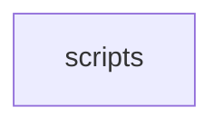
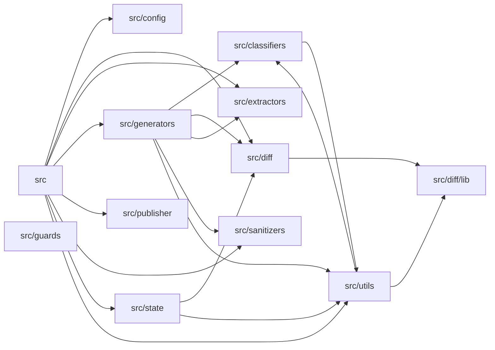

# Architecture

**scripts** -- Operational and pipeline scripts. **core** -- Core wiki-generator infrastructure.

## scripts

Operational and pipeline scripts.

## core

Core wiki-generator infrastructure.
