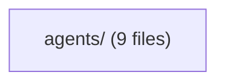
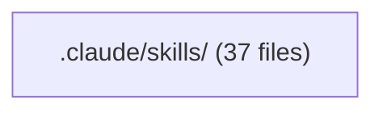
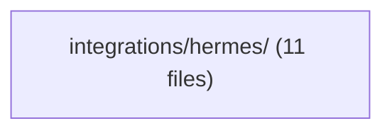
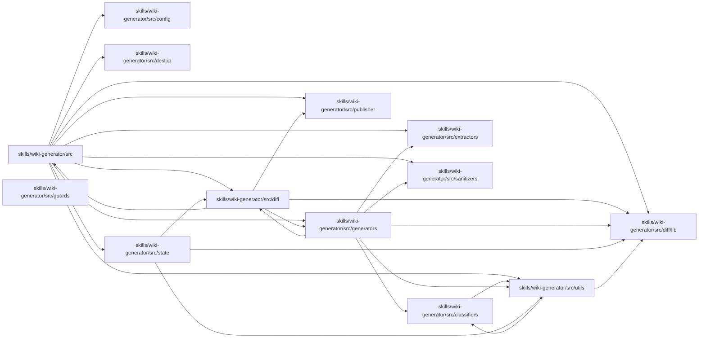

# Architecture

**scripts** -- Operational and pipeline scripts. **agents** -- Agent system prompts and configuration. **.claude/skills** -- Reusable Claude Code skill definitions. **hermes** -- Hermes deployment and scheduling integration. **core** -- Core wiki-generator infrastructure.

## scripts

```mermaid
graph LR
  n0["scripts/ (624 files)"]
```

Operational and pipeline scripts.

## agents

```mermaid
graph LR
  n0["agents/ (9 files)"]
```

Agent system prompts and configuration.

## .claude/skills

```mermaid
graph LR
  n0[".claude/skills/ (37 files)"]
```

Reusable Claude Code skill definitions.

## hermes

```mermaid
graph LR
  n0["integrations/hermes/ (11 files)"]
```

Hermes deployment and scheduling integration.

## core

```mermaid
graph LR
  n0["skills/wiki-generator/src"]
  n1["skills/wiki-generator/src/classifiers"]
  n2["skills/wiki-generator/src/config"]
  n3["skills/wiki-generator/src/deslop"]
  n4["skills/wiki-generator/src/diff"]
  n5["skills/wiki-generator/src/diff/lib"]
  n6["skills/wiki-generator/src/extractors"]
  n7["skills/wiki-generator/src/generators"]
  n8["skills/wiki-generator/src/guards"]
  n9["skills/wiki-generator/src/publisher"]
  n10["skills/wiki-generator/src/sanitizers"]
  n11["skills/wiki-generator/src/state"]
  n12["skills/wiki-generator/src/utils"]
  n0 --> n2
  n0 --> n3
  n0 --> n4
  n0 --> n5
  n0 --> n6
  n0 --> n7
  n0 --> n9
  n0 --> n10
  n0 --> n11
  n0 --> n12
  n1 --> n12
  n4 --> n0
  n4 --> n5
  n4 --> n7
  n4 --> n9
  n7 --> n1
  n7 --> n4
  n7 --> n5
  n7 --> n6
  n7 --> n10
  n7 --> n12
  n11 --> n4
  n11 --> n5
  n11 --> n12
  n12 --> n1
  n12 --> n5
```

Core wiki-generator infrastructure.
