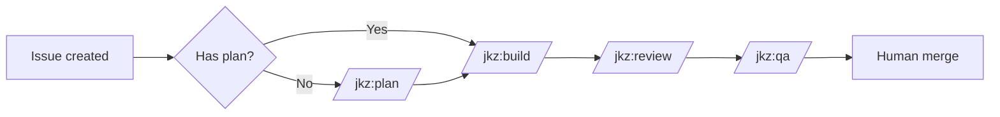
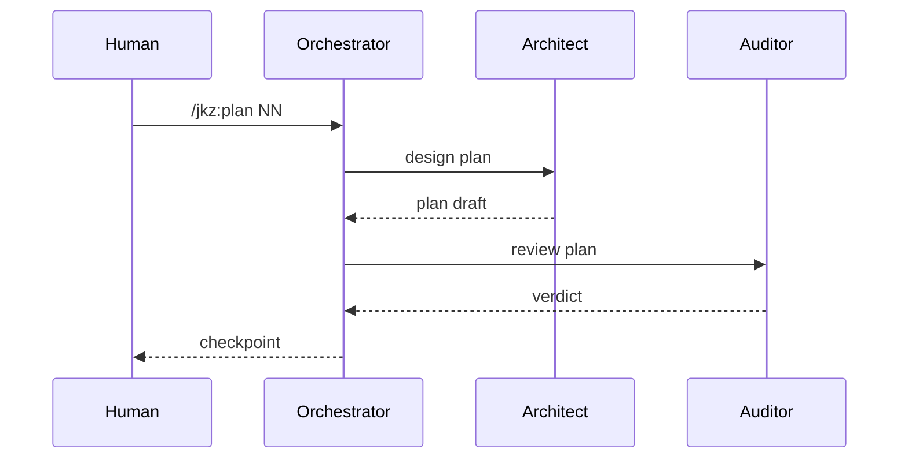

This page exercises the Mermaid integration. Both diagrams below must render as SVG in both light and dark Starlight themes.

## Flowchart

## Sequence

Toggle the site theme to confirm both diagrams re-render with appropriate colors.
