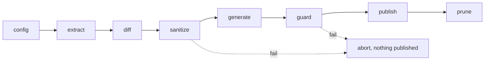

This site is generated. The pages you are reading were not hand-written into `jkz-docs` — they were extracted from the private `jkz_Multi-Agent_System` repository, assembled into prose, screened for leaks, and published as a pull request that a human approved. The subsystem that does this is **wiki-generator**, an internal jkz skill that runs on a schedule and treats one rule as inviolable: **every published byte must trace to a source artifact that has already passed sanitization.**

It is the only part of jkz that crosses the public/private boundary, so it is built to fail closed. If any stage before publishing breaks, the run stops and nothing reaches the public mirror.

## The pipeline at a glance

wiki-generator is an eight-phase pipeline. The phases run in a fixed order, and the loop **breaks on the first failure** — so `publish`, the only phase that writes to the public repo, never runs unless every upstream phase succeeded.

| Phase | What it does | Writes to public repo? |
|-------|--------------|------------------------|
| **config** | Loads `wiki-generator.config.json` (paths, modules, repo URL, enabled generators) | No |
| **extract** | Reads signatures, JSDoc/TSDoc, comments, closed issues, changelog, and READMEs from the source repo | No |
| **diff** | Hashes inputs and detects what actually changed, so unchanged pages are not regenerated | No |
| **sanitize** | Runs the adversarial sanitizer suite — the hard gate | No |
| **generate** | Builds pages with a per-generator model mix (mechanical, Haiku, or Sonnet) | No |
| **guard** | Final hallucination check against the source; no I/O, pure verification | No |
| **publish** | Opens a content PR on `jkz-docs` via the scoped bot token | **Yes** |
| **prune** | Archives stale state files and old run artifacts | No (source-side state) |

## Extractors — read the private repo, never the API

The extract phase pulls raw material from the private repository. File contents are read from a **local checkout, never via the GitHub API**, so the pipeline's token needs no `Contents` access on the source repo at all. What extractors collect:

- **Signatures and types** — parsed from the AST (`ast_extractor`).
- **Doc comments** — JSDoc/TSDoc blocks (`jsdoc_extractor`).
- **Closed issues** — pulled over GraphQL with a cursor for incremental runs (`issue_extractor`), the narrative source for "what shipped."
- **Changelog, config comments, READMEs** — for changelog history, configuration docs, and module summaries.

Issue extraction is the one place a token is used, and it is scoped to **read-only** on the source repo.

## Sanitizers — the hard gate

Sanitizing is not a cleanup pass; it is a blocking gate. The suite must clear **100%** or the run aborts before a single page is generated. It composes several independent screens:

- **Path blocklist** — refuses anything sourced from `.claude/`, `state/`, `secrets/`, and other internal paths. This is the contract that keeps internal structure off the public site.
- **Secret and entropy detection** — flags credentials, tokens, and high-entropy strings.
- **PII sanitizer** — strips personal data.
- **Implementation and issue-log sanitizers** — remove internal implementation detail and redact issue-thread content.

Because sanitizers run *before* generation and the loop breaks on failure, a leak cannot reach the model, the PR, or the public repo. The suite is adversarial by design: new fixtures that defeat detection block the merge until detection is fixed.

## Generators — the right model for each page

Generation is deliberately heterogeneous. Mechanical pages use **no LLM at all** (deterministic and cheap); structural pages use **Haiku 4.5** for low latency; narrative pages use **Sonnet 4.6** for richer prose.

| Generator | Model | Why |
|-----------|-------|-----|
| API reference | none | AST + doc comments rendered straight to markdown — the single source of truth for signatures |
| Reference catalogs & project stats | none | Read frontmatter / config / stats output → markdown |
| `llms.txt` / `llms-full.txt` | none | Mechanical concatenation |
| Sidebar | Haiku 4.5 | Simple structure, low latency |
| Module docs | Sonnet 4.6 | Contextual narrative; embeds the API reference, never duplicates it |
| Workflow & architecture docs | Sonnet 4.6 | How-to guides and mermaid overviews |
| Changelog "What's New" | Sonnet 4.6 | Narrative of recent PRs grouped by type |
| Issue entries | Sonnet 4.6 | Per-category narrative from closed issues |

The API reference is authoritative for signatures: module docs that need a signature **link to** the adjacent API page rather than restating it, so the two never drift.

## Guard — the last check before crossing the boundary

The guard phase is the final pre-publish verification. It re-screens the generated, LLM-authored body against the source material to catch hallucination — content the model invented that has no grounding in the extracted artifacts. It performs **no writes**; it only verifies, and any failure aborts the run before `publish`. Golden snapshots provide a second line of defense, surfacing unexpected drift before a human ever reviews the PR.

## Publisher — the only phase that mutates the public repo

If and only if every prior phase passed, the publisher opens a content PR on `jkz-docs`. It runs under a single **fine-grained PAT** scoped to exactly two repositories: read-only issues on the source repo, and `Contents` + `Pull requests` write on `jkz-docs`. A classic, account-wide token is rejected. The PR carries a generated body, and CI on `jkz-docs` re-runs the sanitizer suite, checks links, and validates `llms.txt` — the same guarantees, enforced again on the public side.

## The human-in-the-loop model

wiki-generator ships with **HITL on by default** (`WIKI_HITL_REQUIRED=true`). The pipeline prepares everything up to a pull request and then **stops**: a human reviews the diff and merges. This mirrors jkz's core rule — the machine does the work, the human crosses the final line.

- **HITL on (default):** the PR waits for manual approval. Sanitizers and CI still run, so a broken or leaky PR is visibly broken and is not merged.
- **HITL off (future):** a green CI run could auto-merge via the bot token. The switch is only ever flipped after confirming the adversarial suite has had no false negatives across recent runs.

Either way the sanitizer gate stays critical, not lax. Turning off the human gate would never turn off the leak gate.

## Operation

The pipeline is run by **Hermes on a daily schedule** (05:00 America/Santiago), staggered after the documentation-sync job to avoid collision. To avoid stacking work, a run **auto-skips** if the previous PR has not merged within 48 hours. Operational events route to dedicated Telegram topics — run summaries and warnings to one, sanitizer and sync failures to another — and the bot token is rotated on a fixed 90-day cadence.

## What this is not

- **Not the development pipeline.** wiki-generator documents jkz; it is not the Plan → Build → QA loop that *builds* jkz. For that, see [the pipeline](/concepts/pipeline/).
- **Not a free-form writer.** Every page traces to an extracted, sanitized artifact. The guard phase exists precisely to reject content that does not.
- **Not self-merging.** With HITL on, it stops at a PR. A human merges.

## Related

- [The pipeline](/concepts/pipeline/) — the three-phase development loop wiki-generator documents.
- [Evidence hierarchy](/concepts/evidence-hierarchy/) — the same "trace every claim to a source" discipline, applied to deliberation.
- [Architecture](/reference/architecture/) — where this subsystem sits in the wider system.
- [Design decisions](/reference/design-decisions/) — the ADRs behind the stack choices, including the docs site itself.
